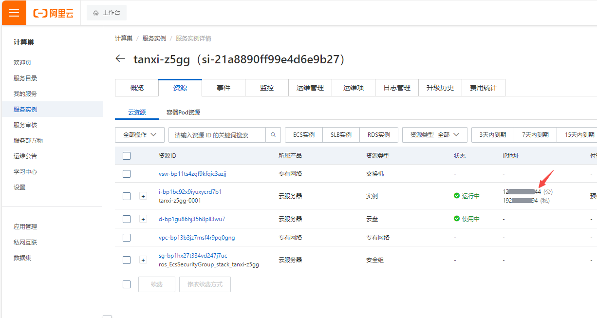
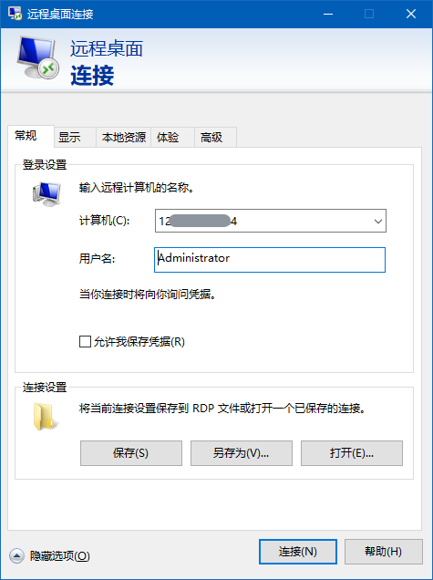
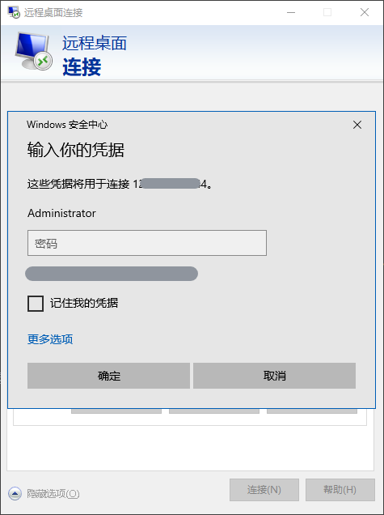
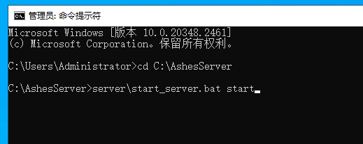

# 炭熄（Ashes）服务实例部署文档

## 概述

`炭熄是一款全球首发的中式民俗生存冒险SOC游戏，以其独特的开放阴间世界概念，带领玩家进入一个完全由程序随机生成的广袤阴间世界，在这里可以和好友联机寻找瑶山背后所发生的故事。本文介绍如何在阿里云计算巢控制台，快速部署炭熄联机服务，实现和朋友一起联机游戏。
预计部署时间5分钟，有任何问题请查看下方的QQ群，进群交流～
`

```
《炭熄》官方交流1群：861071677
《炭熄》官方交流2群：933262638
```

## 计费说明

`炭熄联机服务在计算巢上的费用主要涉及：所选vCPU与内存规格、磁盘容量、公网带宽 计费方式包括：包年包月 预估费用在创建实例时可实时看到。`


## 创建云服务器
### 第一步：选择配置
1. 服务实例名称（如无特殊要求，保持默认即可）；
2. 选择部署地域（可以选择离自己最近的城市，如无特殊要求，保持默认即可）；
3. 选择付费时长（目前只支持包年包月）
4. 选择配置
   这里提供了几款配置供大家选择：
   | 套餐名          | 说明                        |
   |--------------|---------------------------|
   | 支持最多10个玩家     | 2核8G，5M带宽不限流量      |
   | 支持最多10个玩家     | 4核16G，10M带宽不限流量      |
   | 支持10-16个玩家   | 8核32G，10M带宽不限流量    |
   | 自定义套餐        | 可自由选择ECS配置，适合高阶DIY玩家      |

   
5. 配置服务器密码（记住你的密码，后面要用）；
6. 配置可用区（如无特殊要求，保持默认即可）。
7. 在游戏基础设置栏中配置联机服务的参数（不修改则使用默认值）。

   
8. 在游戏高级设置栏中配置联机服务的参数（不修改则使用默认值）。

   
   配置完成之后，点击下一步，确认提交订单。

### 第二步：创建服务
1. 在服务确认页面，勾选同意服务条款，点击`立即创建`，后面就是付款流程。

   
2. 当出现提交成功提示，说明服务已经开始创建，点击“去列表查看”，可以看到服务正在部署中。

   

   

### 第三步：进入实例详情
1. 服务大约2分钟即可完成创建，创建完成后如果开启了自动更新游戏服务器选项时，游戏更新过程会消耗大约5分钟
2. 到这一步的时候，帕鲁的服务端安装程序已经预置在服务的镜像里了，无需手动复制，非常方便。

3. 当服务的状态变成“已部署”，点击服务实例ID进入服务详情。

   
4. 看到“炭熄服务器地址端口”，这就是你搭建服务器的IP地址了，复制这个地址用于下一步操作。

   


## 登录游戏

前置条件：您首先需要在Steam购买`炭熄（Ashes)`。
1. 登录您的Steam账号。
2. 在“库”中找到炭熄，并开始游戏。

   
3. 如果你的`游戏平台`选择的是`steam`，在游戏内点击`加入世界`,然后点击`社区`按钮，等待刷新一段时间后选择你的游戏服务器，点击`连接`进入游戏

   
4. 也可以直接点击`添加服务器`按钮，输入你的服务器IP以及端口号加入游戏。

   

至此，您已经成功搭建了炭熄 Dedicated Server ，请和您的朋友在此中一起畅快游玩吧～


## Windows服务器
### 连接服务器
1. 在计算巢服务点击实例，在资源页找到资源类型为`实例`的公网IP

   

   
2. 在windows的搜索栏输入`mstsc`,打开`远程桌面连接`程序

   
3. 在`计算机`栏输入上面找到的服务器公网IP,`用户名`栏输入`Administrator`,然后点击`连接`

   
4. 输入你在创建服务时输入的实例密码 ，然后点击`确定`

   

5. 在资源管理器中进入`C:\AshesServer`,可以看到服务器的工作目录


   `World` 目录为游戏世界的存档目录

   `.env` 文件为游戏的设置文件

   `server` 目录为游戏的安装目录

关于服务器的介绍在`C:\AshesServer\server`目录下查看`Ashes Dedicated Server Manual_zh.pdf`文档获取更多细节。

### 替换存档
1. 按照上面的步骤进入游戏服务器实例。
2. 在搜索栏中输入`cmd`打开命令提示符


3. 输入`cd C:\AshesServer`然后按回车进入工作目录，**这一步很重要，不能省略哦~**


4. 输入`server\start_server.bat stop` 然后按回车关闭游戏服务器，


5. 删除或者备份在`C:\AshesServer`目录下`Worlds`文件夹，将你上传上的存档放在这个目录下，保证文件夹的名字也是`Worlds`

6. 再次重复`2`,`3`步骤， 打开`cmd`,输入`cd C:\AshesServer`
7. 输入`server\start_server.bat start` 然后按回车启动游戏服务器



8. 游戏服务器启动过程中可能会有更新的操作，根据网络情况的不同会有几分钟左右的更新时间，请耐心等待~


9. 当看到提示 server started 时，表示服务器已经成功启动

**不要关闭命令提示符窗口，否则游戏服务器会被关闭，重要的事情说三遍!**

**不要关闭命令提示符窗口，否则游戏服务器会被关闭，重要的事情说三遍!** 

**不要关闭命令提示符窗口，否则游戏服务器会被关闭，重要的事情说三遍!** 


10. 到此，整个游戏存档就替换完毕啦~

### 其他操作
1. 进入计算巢中实例的`运维管理`页签，这里提供了一些基础游戏服务器操作


`重启游戏服务器`：关闭并重新启动游戏服务器

`更新游戏服务器`：关闭然后更新游戏服务器，更新完毕后会启动游戏服务器

`清除存档`：关闭游戏服务器，然后清除存档，清除完毕后会启动游戏服务器

`下载存档`：关闭游戏服务，然后会将游戏世界存档打包成zip文件，打包完毕后会启动游戏服务器。
下载路径查看输出日志。


`上传存档`：只是上传选择的文件到游戏的工作目录`C:\AshesServer`, 替换存档的操作可以见上方的**替换存档**步骤